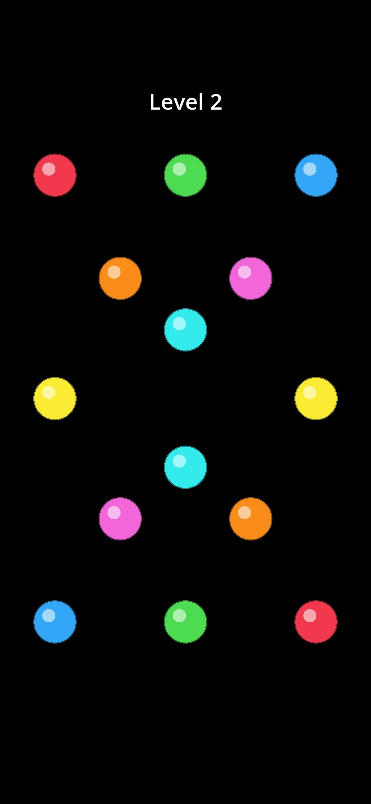

# Ball Connect

A ball-connect puzzle game. Simple and plain. NO ADS! NO BS! **No IAP, no analytics, no tracking.** Just a simple game... 

Drag a line from a colored ball to its same-color partner. Lines cannot cross
each other, cannot cross themselves, and cannot pass through other balls.
Connect every pair to win the level.

<p align="center">
  
</p>

## Install on Android

**Direct APK download:**
https://github.com/Matswm86/ball-connect/releases/download/latest/ball-connect.apk

1. Open that link in your phone's browser and tap to download.
2. When you tap the downloaded file, Android may say *"For your security, your
   phone is not allowed to install unknown apps from this source."* Tap
   **Settings**, toggle **Allow from this source**, then go back and install.
3. The app appears as **Ball Connect**.

> The APK is **debug-signed** with a stable key (stored as the
> `ANDROID_DEBUG_KEYSTORE_BASE64` GitHub secret), so reinstalling a newer
> build over an older one Just Works — no uninstall needed.
>
> *One-time exception:* the very first build with the stable key replaces
> earlier ephemeral-key builds, so if you installed the APK before
> 2026-04-28 you'll need to uninstall once before this build installs.

Permanent versioned downloads are also published to the
[Releases page](https://github.com/Matswm86/ball-connect/releases) when a
`vX.Y.Z` tag is pushed.

## Difficulty

Starts hard. Level 1 has 6 colour pairs on a non-grid 1080×1920 board.
Level 5 has 8 pairs in a tighter layout. Add more by dropping
`data/levels/level_NN.json` files and bumping `max_level` in the Game scene.

## Run from source (desktop)

1. Install **Godot 4.6.x** from https://godotengine.org/ (single binary, no
   install needed — just extract and run).
2. Open the editor → **Import** → pick `project.godot` in this folder.
3. Press **F5** (or hit ▶). Mouse acts as touch on desktop.

## Level format

Each level is a JSON file in `data/levels/`. Coordinates are absolute pixels
referenced to a 1080×1920 viewport (the project stretch mode handles scaling
on other resolutions).

```json
{
  "level": 1,
  "ball_radius": 70,
  "balls": [
    {"color": "red",  "x": 180, "y": 350},
    {"color": "red",  "x": 900, "y": 1550},
    {"color": "blue", "x": 900, "y": 350},
    {"color": "blue", "x": 180, "y": 1550}
  ]
}
```

Each color must appear exactly twice. Supported colors are defined in
`scripts/GameManager.gd` (`COLOR_MAP`): `red`, `blue`, `green`, `yellow`,
`orange`, `pink`, `cyan`, `purple`. Add more by extending the dict.

## CI builds (how the APK gets made)

Every push to `main` triggers `.github/workflows/build-android.yml`, which:

1. Spins up `ubuntu-latest`, installs Java 17 + Android SDK.
2. Downloads Godot 4.6.2 headless + Android export templates.
3. Decodes the stable debug keystore from the `ANDROID_DEBUG_KEYSTORE_BASE64`
   secret (falls back to generating an ephemeral keystore if the secret
   isn't set, so forks still build).
4. Writes `editor_settings-4.6.tres` and the build template marker files.
5. Runs `godot --headless --export-debug "Android" ball-connect.apk`.
6. Uploads the APK as a workflow artifact, **and** updates the rolling
   `latest` pre-release on the Releases page.

For a permanent versioned APK: `git tag v0.1.0 && git push --tags`.

Gotchas captured the hard way are in
[`docs/godot-android-ci-notes.md`](docs/godot-android-ci-notes.md) — read
that before reusing this workflow on another Godot project.

## Build APK locally (alternative to CI)

If you'd rather build on your laptop:

1. Install **Android Studio** from https://developer.android.com/studio.
   Open it once, let it install the default SDK, then close it.
2. Install `adb`: `sudo apt install android-tools-adb` (or use the
   [standalone platform-tools](https://developer.android.com/tools/releases/platform-tools)).
3. In Godot: **Editor → Editor Settings → Export → Android**. Set:
   - Java SDK Path → e.g. `/usr/lib/jvm/java-17-openjdk-amd64`
   - Android SDK Path → e.g. `~/Android/Sdk`
4. **Project → Install Android Build Template** (one-click; uses the source
   template that came with your Godot install).
5. **Project → Export → Add… → Android**. Confirm `Use Gradle Build` is on.
   `export_presets.cfg` already has the rest configured.
6. Click **Export Project** → produces `ball-connect.apk`.
7. Sideload: `adb install ball-connect.apk` (with your phone plugged in and
   USB debugging enabled).

## File map

```
project.godot                   Engine settings (1080×1920 portrait, GL Compat)
export_presets.cfg              Android export preset (gradle build, arm64-v8a)
icon.svg                        App icon
.github/workflows/
  build-android.yml             CI workflow that produces the APK
docs/
  godot-android-ci-notes.md     Lessons learned from the 9-run CI debug saga
scenes/
  Game.tscn                     Root scene
  Ball.tscn                     Ball template (instanced per ball)
scripts/
  GameManager.gd                Level loader, win detection, scene transitions
  LineDrawer.gd                 Touch handling, polyline + segment-intersection
  Ball.gd                       Ball draw + hit-test
data/levels/
  level_01.json                 …through level_05.json
screenshots/
  level_2.jpeg                  In-game screenshot
```

## Design rules (locked-in defaults)

- Free-form polyline path; sampled every 10px of finger movement.
- A new segment is rejected if it crosses any other path, crosses the current
  path's earlier segments, or passes within 85% of any non-endpoint ball's
  radius.
- Tap-and-drag from a ball that already has a path replaces that path.
- Release on the matching-color other ball completes the pair; release
  anywhere else cancels the in-progress drag.
- Win condition: all colors completed. Tap once to advance.

Tweak in `scripts/LineDrawer.gd`:
- `SAMPLE_DIST` — finer = smoother curves, more CPU
- `LINE_WIDTH` — visual thickness
- `BALL_BLOCK_FACTOR` — lower = easier to squeeze between balls
